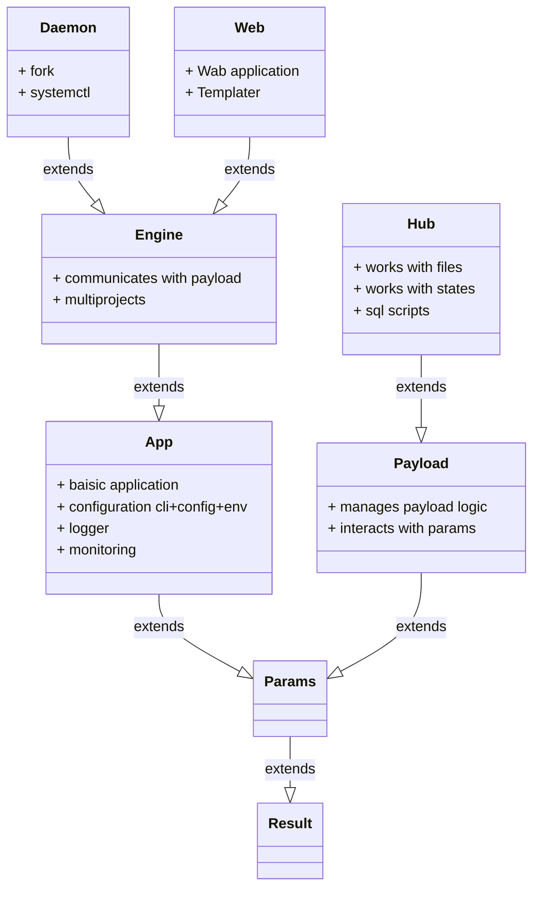
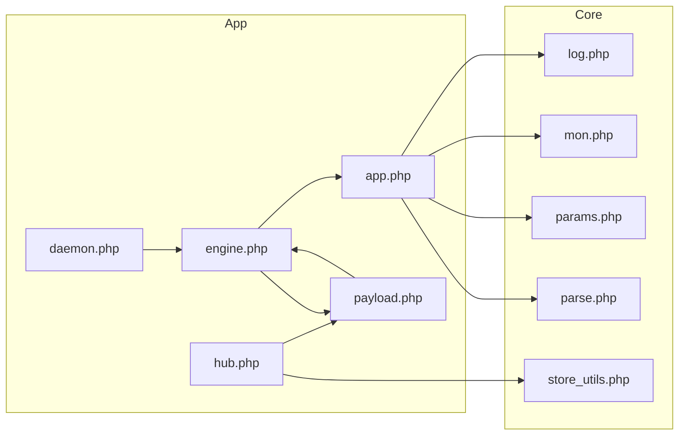

# app

1. Libraries of Catlair applications.

## Dependenсes

### Software

1. php 8.x
0. php-yaml
0. php-json
0. php-mbsteing

### Projects

1. https://github.com/johnthesmith/catlair-php-lib-core

## Class inheritance diagramm

## Inclusions Diagram

