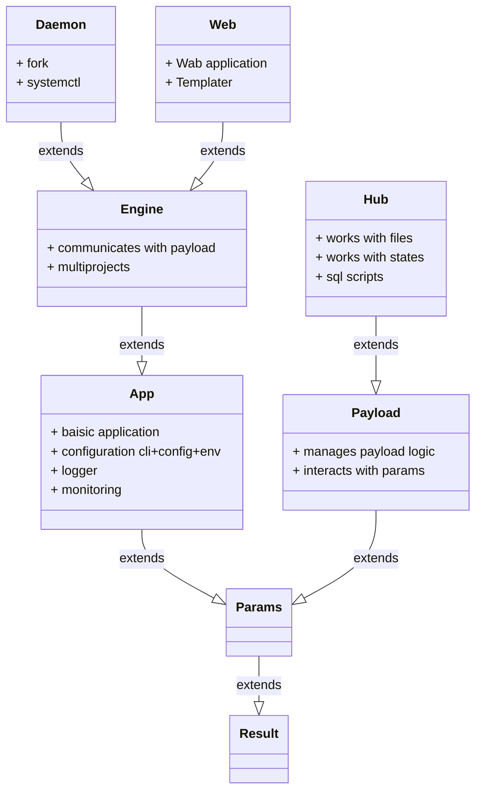
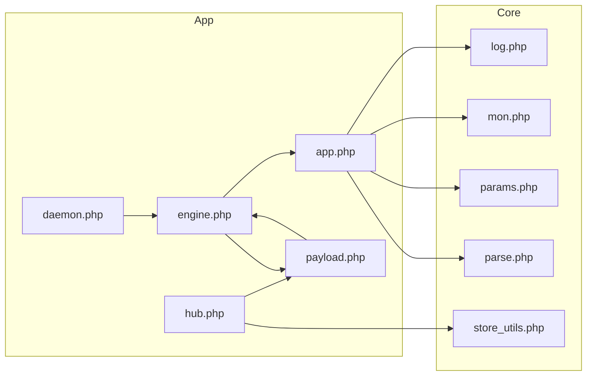

# app

1. This repository contains application php code for Catlair.
0. The project provides the ability to develop console applications based on payloads.

## Dependenсes

1. This project has dependencies on third-party software and projects.
    1. [Software](#software)
    0. [Projects](#projects)

### Software

1. The following software will need to be installed:
    1. php 8.x
    0. php-yaml
    0. php-json
    0. php-mbstring

### Projects

1. The following projects are required for use:
    1. https://github.com/johnthesmith/catlair-php-lib-core

## Class inheritance diagramm

## Inclusions Diagram

